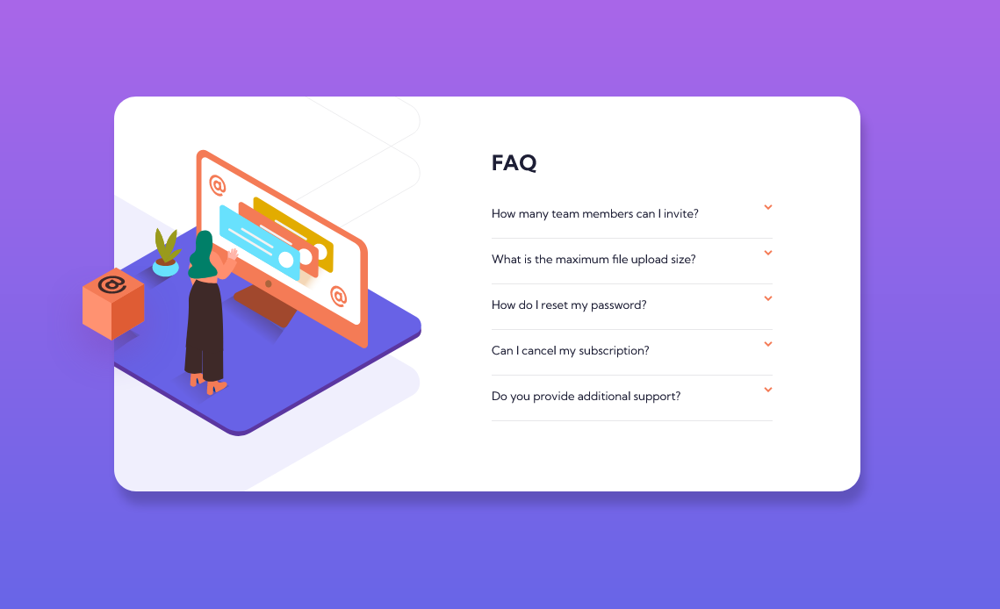
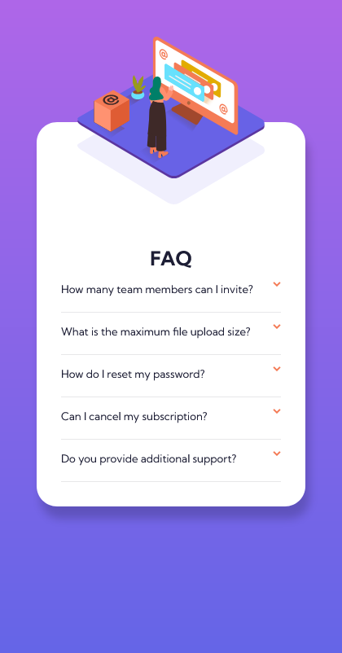

# Frontend Mentor - FAQ accordion card solution

This is a solution to the [FAQ accordion card challenge on Frontend Mentor](https://www.frontendmentor.io/challenges/faq-accordion-card-XlyjD0Oam). Frontend Mentor challenges help you improve your coding skills by building realistic projects. 

## Índice

- [Visão geral](#visão geral)
   - [O desafio](#o-desafio)
   - [Captura de tela](#captura-de-tela)
   - [Links](#links)
- [Meu processo](#meu-processo)
   - [Construído com](#construído-com)
   - [O que aprendi](#o-que-aprendi)
   - [Desenvolvimento contínuo](#desenvolvimento-contínuo)
   - [Recursos úteis](#useful-resources)
- [Autor](#autor)

## Visão geral

### O desafio

Os usuários devem ser capazes de:

- Visualize o layout ideal para o componente, dependendo do tamanho da tela do dispositivo
- Veja os estados de foco para todos os elementos interativos na página
- Ocultar/Mostrar a resposta a uma pergunta quando a pergunta é clicada

### Captura de tela




### Links

- URL da solução: (https://github.com/felipe1590/faq-accordion-card-main)
- URL do site ao vivo: (https://felipe1590.github.io/faq-accordion-card-main/)

## Meu processo

### Construído com

- Marcação HTML5 semântica
- Propriedades personalizadas CSS
- Flexbox
- Fluxo de trabalho mobile first
- Programar botões em JavaScript

### O que eu aprendi

```html
<section class="pergunta">
  <div class="pergunta-bloco">
    <h2 id="pg1" class="titulo-pergunta">How many team members can I invite?</h2>
    <button id="btn-a" class="botao">
      
    </button>
  </div>
  <div id="res1" class="resposta-pergunta">
    <p>
      You can invite up to 2 additional users on the Free plan. There is no limit on
      team members for the Premium plan.
    </p>
  </div>
</section>
```
Aqui trabalhei de forma onde cada section tivesse seu próprio modo de expanção, com div's em cada parte que ficaria escondida até sem chama via script

```css
.container {
  position: absolute;
  top: 50%;
  left: 50%;
  transform: translate(-50%, -50%);
  width: 850px;
  display: flex;
  flex-direction: row;
  gap: 60px;
  margin: 0 0;
  padding: 60px 60px 60px 0px;

  background: url('/images/bg-pattern-desktop.svg') no-repeat;
  background-color: white;
  background-size: 90%;
  background-position: -490% 70%;
}
```
Preferi trabalhar com o background dessa forma, para que podesse posicionar o manipular do jeito que se encaixasse bem em qualquer tipo de tela, usadno siz, position para chegar o mais perto possível do resultado proposto.

```javascript
buttonA.addEventListener('click', function(){

    var containerA = document.querySelector('#res1')
    var tituloA = document.querySelector('#pg1') 

    buttonA.classList.toggle('rotate')
    containerA.classList.toggle('hide')
    tituloA.classList.toggle('pg')
})
```

Não sendo ainda o modo mais simples de fazer, mas executei da melhor maneira que achei possível para o meu nível de aprendizado.

### Desenvolvimento contínuo

Estou focando em aprender sobre layouts responsivos e como posso integrar isso ao JavaScript, desenvolvendo meus conhecimentos de maneira estruturada e focada no estudo aplicado do Front-end, depois de terminar todos os módulos do curso de Html e Css do Curso em Vídeo(https://www.cursoemvideo.com/) e partir para o básico de JavaScript. Estou enpenhado em produzir sites bonitos, mas semanticamente bem feitos, utilizando técnicas atualizadas de css, empregradas aos scripts simples.

### Recursos úteis

- [Esconder ou mostrar div com JavaScript!](https://youtu.be/0y9qookjE0w) - Isso me ajudou a entender como posso adicionar elementos a uma div, de forma fácil e simples, com um script de certa forma longo, mas funcional.
- [A Complete Guide to Flexbox](https://css-tricks.com/snippets/css/a-guide-to-flexbox/) - Este é um artigo incrível que me ajudou a finalmente entender mais a fundo como Flexbox ao mesmo tempo pode parecer complexo no começo, mas o treino e tempo mostram que essa inovação só tem a agregar na criação de sites de maneira mais descomplicada. Recomendo a todos que ainda estão aprendendo esse conceito.

## Autor

- Website - [Felipe Gama](https://felipe1590.github.io/portfolio/)
- Frontend Mentor - [@felipe1590](https://www.frontendmentor.io/profile/felipe1590)
- Linkedin - [Felipe Gama](https://www.linkedin.com/in/felipe-gama-3a5638265/)
